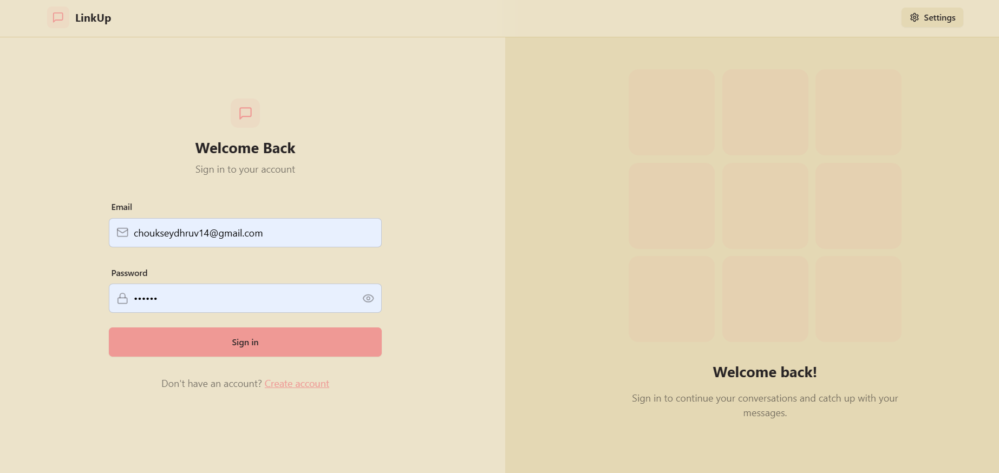
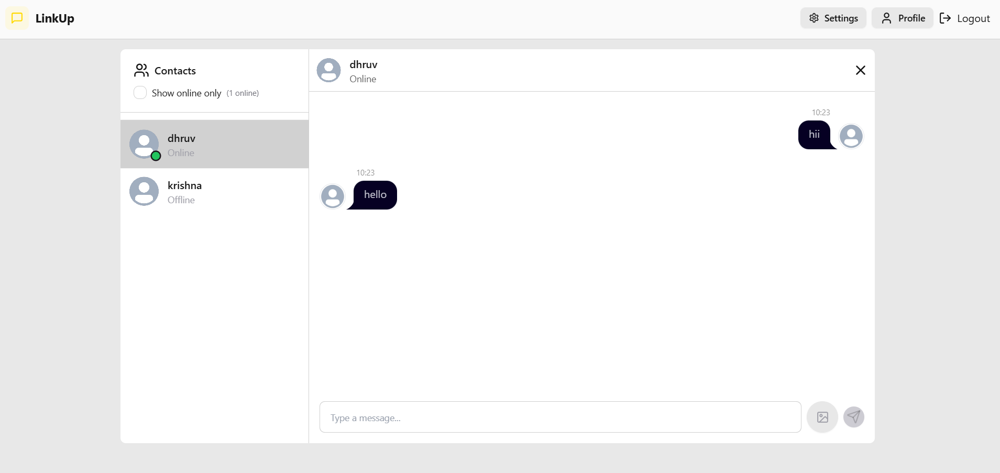

# Real-time-Chat-App

Live Demo : https://real-time-chat-app-5dqr.onrender.com

# 🚀 Chat App


A powerful real-time chat application with authentication, theming, and media sharing.

## 🌟 Features
- **Real-Time Messaging** 📩
- **User Authentication** 🔐 (JWT-based login & signup)
- **Theming (Zustand + DaisyUI)** 🌗 (DaisyUI themes with Zustand state management where you can change theme according to your preference)
- **Online Status Indicator** 🟢
- **Profile Customization** 🖼️
- **Cloudinary Integration** ☁️ (Image Upload & Sharing)
- **Responsive UI** 📱 (Tailwind CSS)

---

## 📸 Screenshots


### 🔐 Login Page


### 📜 Chat Interface


---

## 🛠️ Tech Stack
- **Frontend:** React, Tailwind CSS, DaisyUI, Zustand
- **Backend:** Node.js, Express.js, MongoDB
- **Authentication:** JWT
- **Storage:** Cloudinary
- **Real-time:** WebSockets (Socket.io)

---

## 🚀 Getting Started

### 1️⃣ Clone the repository
```sh
git clone https://github.com/DhruvChouksey14/Real-time-Chat-App.git
cd Real-time-Chat-App
```

### 2️⃣ Set up the environment variables
Create a `.env` file in the **backend** directory and add:
```env
MONGODB_URI=your_mongo_uri_here
PORT=5001
JWT_SECRET=your_jwt_secret_here
CLOUDINARY_CLOUD_NAME=your_cloud_name_here
CLOUDINARY_API_KEY=your_api_key_here
CLOUDINARY_API_SECRET=your_api_secret_here
NODE_ENV=development
```

### 3️⃣ Install dependencies
#### Frontend:
```sh
cd frontend
npm install
```

#### Backend:
```sh
cd backend
npm install
```

### 4️⃣ Start the application
#### Run backend:
```sh
cd backend
npm run dev
```

#### Run frontend:
```sh
cd frontend
npm run dev
```

Now visit **http://localhost:5173/** to see your app in action! 🎉

---

---


